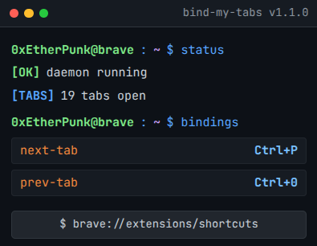

# bind-my-tabs

Minimalist tab switching daemon for Brave / Chromium.

  

## Architecture

- Pure Manifest V3 `chrome.commands` backend
- No injected content scripts into DOM

## Install

1. Open `brave://extensions`
2. Enable **Developer mode**
3. Click **Load unpacked** and select this directory

## Configure Shortcuts

Open `brave://extensions/shortcuts` and bind commands:
- `next-tab`
- `prev-tab`
